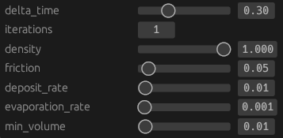

# egui_show
proc-macro egui generator

## Usage example:
```rust
#[derive(Debug, Clone, EguiShow)]
pub struct HydraulicErosion {
    #[egui_show(range = "0.0 ..= 1.0")]
    pub delta_time: f32,

    pub iterations: usize,

    /* #[egui_show(range = "0 ..= 1000")]
    pub max_lifetime: usize, */

    #[egui_show(range = "0.0 ..= 1.0")]
    pub density: f32,

    #[egui_show(range = "0.0 ..= 1.0")]
    pub friction: f32,

    #[egui_show(range = "0.0 ..= 1.0")]
    pub deposit_rate: f32,

    #[egui_show(range = "0.001 ..= 1.0")]
    pub evaporation_rate: f32,

    #[egui_show(range = "0.0 ..= 1.0")]
    pub min_volume: f32,

	#[egui_show(skip)]
	pub hidden: f32,

	also_hidden: f32,
}

...

let mut obj: HydraulicErosion = ...;

...

egui::Grid::new("grid").num_columns(2).show(ui, |ui| {
	obj.show();
}
```

## Fields
All `pub` fields are 'shown' by default. This can be skipped with the `#[egui_show(skip)]` attribute. `#[egui_show(range = "0.0 ..= 1.0")]` lets you specify a range of possible values.

## Usage example result:
